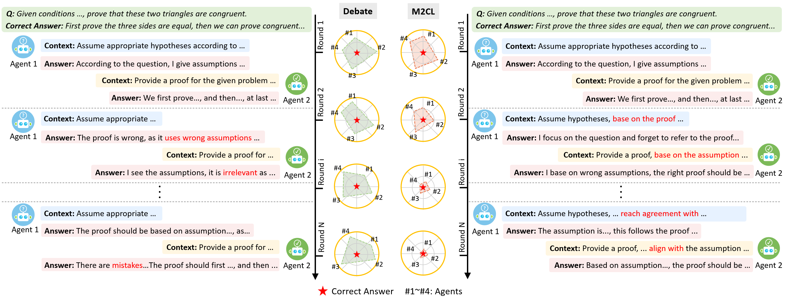

# Context Learning for Multi-Agent Discussion
<p align="center">
&nbsp&nbsp🌐 <a href="">Website</a>&nbsp&nbsp | &nbsp&nbsp📑 <a href="">arXiv</a>&nbsp&nbsp | &nbsp&nbsp🤖 <a href="">Model</a>&nbsp&nbsp | &nbsp&nbsp🤗 <a href="">Hugging Face</a>&nbsp&nbsp
</p>

<p align="center">
  
</p>

## 📢 Updates
- [2025-11-30] We released checkpoints of initialization and context generators.
- [2026-2-3] We released training code.
- [2026-2-3] We publish the paper o arxiv.
- [2026-1-26] This paper was accepted by ICLR'26

## 🔨 TODO
- [ ] Polish the codebase.
- [ ] Merge with the latest verl version.
- [ ] Release the model checkpoint for initialization and generator.
- [ ] Add the training code and pipeline.

## 🚀 Quick Start

This guide provides instructions for setting up the M2CL, including execution scripts for infering and training.

### 1. Preparation

#### Download Code

Download the code from Github.
```bash
git clone https://github.com/HansenHua/M2CL-ICLR26.git
cd M2CL-ICLR26
```

#### Download Dataset

Download the dataset using the HuggingFace CLI. Replace `<dataset name>` with the dataset path and `<your local path>` with your actual directory.

```bash
mkdir dataset
huggingface-cli download <dataset name> --local-dir <your local path>
```

#### Prepare Backbone Model

Download the backbonen model for inference using the HuggingFace CLI. Replace `<model_path>` with the model for inference and `<your local path>` with your actual directory.

```bash
mkdir model
huggingface-cli download model_path --local-dir <your local path>
```

#### Prepare Model Checkpoints (TODO)

Download the context intialization and generator model using the HuggingFace CLI. Replace `<your local path>` with your actual directory.

```bash
huggingface-cli download model_path --local-dir <your local path>
```

### 2. Env Initialization

Initialize the python environment on your **GPU Machine**.

#### Install dependent packages

```bash
conda create -n your_env python=3.9
conda activate your-env
pip install -r requirements.txt
```

### 3. Execution

```bash
python main.py
```
The code allows for 
```
--dataset The name of the dataset.
--method The name of the method.
--model The backbone model name.
--model_path Path to the model checkpoint.
--generator_path Path to the context generator.
--num Number of agents.
--max_rounds Maximum number of debating rounds.
--seed Random seed.
--n Number of chat completion candidates.
--temperature Sampling temperature, in range [0, 2].
--alpha Alpha coefficient.
--beta Beta coefficient.
--max_completion_tokens Maximum number of completion tokens.
--top_k Top-k combinations selected.
--contribution_threshold Threshold for agent contribution filtering.
--process_num Number of parallel processes.
--train_rounds Maximum number of training rounds.
```

## 📝 Citation
If you find our paper and code useful in your research, please consider giving a star ⭐ and citation 📝 :)

```bibtex
@article{li2025dart,
  title = {Efficient Multi-turn RL for GUI Agents via Decoupled Training and Adaptive Data Curation},
  author={Li, Pengxiang and Hu, Zechen and Shang, Zirui and Wu, Jingrong and Liu, Yang and Liu, Hui and Gao, Zhi and Shi, Chenrui and Zhang, Bofei and Zhang, Zihao and Shi, Xiaochuan and Yu, Zedong and Wu, Yuwei and Wu, Xinxiao and Jia, Yunde and Xiang, Liuyu and He, Zhaofeng and Li, Qing},
  journal={arXiv preprint arXiv:2509.23866},
  year={2025}
  url = {https://arxiv.org/abs/2509.23866}
}
```
